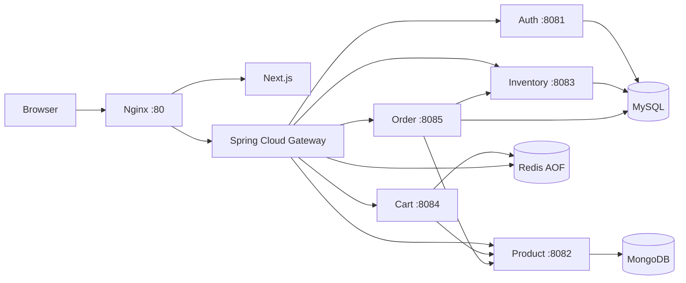
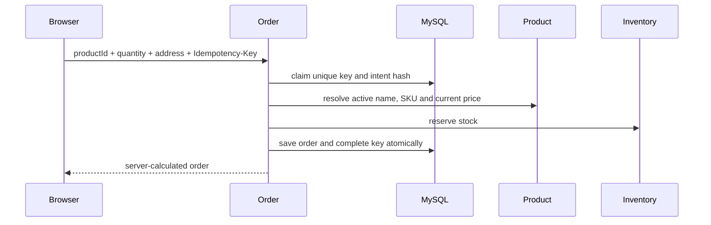
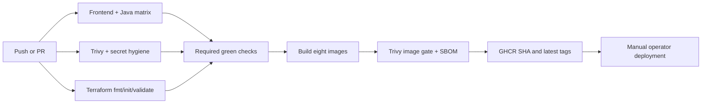
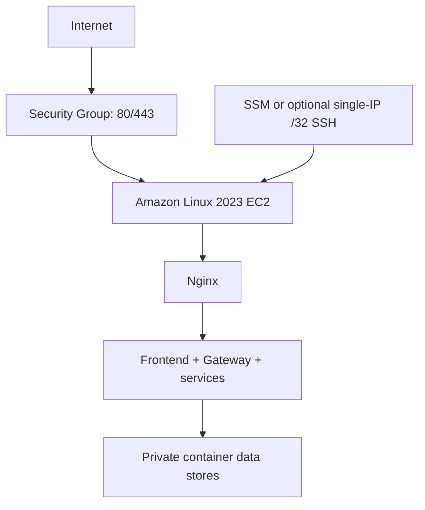
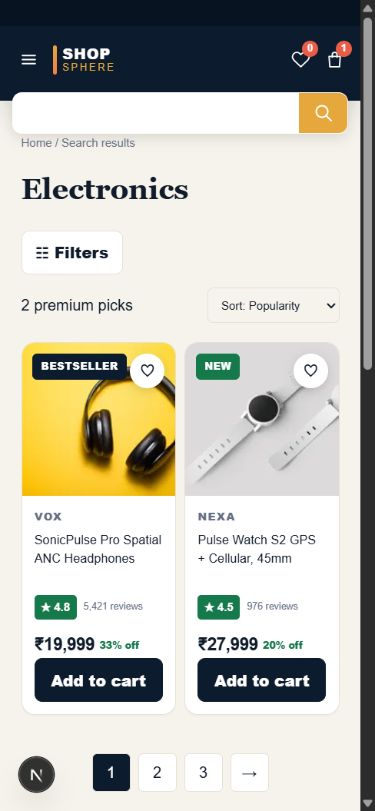

# ShopSphere

> Enterprise-style cloud-native e-commerce platform built as a DevOps, platform engineering and full-stack portfolio project.


ShopSphere is a responsive marketplace with real authentication, product discovery, durable carts, inventory-aware checkout, order history and administrator operations. The browser reaches five Java 21 microservices through Nginx and Spring Cloud Gateway. MySQL, MongoDB and Redis provide service-owned persistence. The repository also includes CI/CD, image publishing, security scanning, observability, load tests and cost-conscious AWS infrastructure as code.

This is a portfolio-scale system. Payment is simulated. **AWS infrastructure is Terraform-ready but has not been provisioned.**

## Architecture



Nginx is the public reverse proxy and serves the frontend in the production layout. Gateway owns API routing, JWT/role enforcement, CORS, rate limits, correlation IDs, timeouts, circuit breakers and safe GET-only retries. Business services remain private in production Compose.

### Microservices

| Application | Responsibility | Persistence |
|---|---|---|
| Auth Service | Registration, BCrypt login, access/refresh JWTs and account profile | MySQL + Flyway |
| Product Service | Catalog CRUD, search, filters, sorting and authoritative prices | MongoDB |
| Inventory Service | Available/reserved stock and adjustments | MySQL + Flyway |
| Cart Service | User-owned cart and server-priced line items | Redis with AOF and TTL |
| Order Service | Checkout, server totals, history, fulfillment and durable idempotency | MySQL + Flyway |
| Gateway | Edge authorization, resilience, rate limiting and request correlation | Redis counters |

Each Java application uses Spring Boot 3.5, Java 21, Actuator and Micrometer Prometheus. Relational schemas have separate service databases/users. MongoDB suits flexible catalog attributes; Redis suits expiring carts and edge counters.

## Frontend

The Next.js 16 / React 19 / TypeScript storefront includes:

- Responsive marketplace homepage, categories, search/listing and product detail pages
- Product-specific imagery with category-local fallbacks and no browser broken-image icon
- Customer registration/login, account, cart, checkout and order history/details
- Real cart merge and API integration through the Nginx/Gateway path
- Admin-only product CRUD, stock adjustment and order status workflows
- Explicit customer-admin limitation instead of fabricated customer data
- Accessible labels, focus states, semantic buttons, bounded media and responsive layouts

Wishlist remains browser-local. The access token is session-scoped; the refresh token is browser-local. See [frontend/backend integration](docs/frontend-backend-integration.md) for the security trade-offs.

## Secure checkout



Browser-supplied names, SKUs, prices, discounts and totals are ignored. The Order service obtains catalog data from Product and calculates subtotal, discount, delivery and total. Repeating the same completed intent/key returns the existing order without another reservation; conflicting reuse returns 409. Caught failures trigger best-effort inventory compensation. Details and crash-window limitations are in [order idempotency](docs/order-idempotency.md).

## Containers and local topology

- Multi-stage Java builds use Maven/Temurin 21 and minimal Temurin JRE Alpine runtime images.
- The frontend uses a multi-stage Node Alpine standalone build.
- Java, Next.js and Nginx runtime containers run as non-root.
- Production application containers drop Linux capabilities and set `no-new-privileges`.
- `compose.yaml` is the developer stack; ports bind to loopback.
- `compose.prod.yaml` publishes only Nginx. Databases and ports 8081–8085 stay private.
- Named MySQL, MongoDB and Redis volumes are retained across application restarts.
- `compose.build-local.yaml` is an explicitly documented host-JAR fallback for development environments where Docker build egress is unavailable.

## CI/CD and GHCR



[CI](.github/workflows/ci.yml) validates Node 22 lint/build/typecheck and runs Maven test/package for Gateway plus five services on Java 21. Main-branch publication uses BuildKit caching, loads and scans every image before GHCR login/push, generates CycloneDX SBOM artifacts, and publishes both the immutable git SHA and `latest`. Deployments should select the full SHA.

[Security CI](.github/workflows/security.yml) performs secret hygiene plus repository secret/configuration scans without resolving Maven dependencies. Every production Docker image receives a fixed HIGH/CRITICAL vulnerability gate before its GHCR push. [Dependabot](.github/dependabot.yml) covers npm, Maven, GitHub Actions, Docker and Terraform. No personal registry token or AWS credential is stored in a workflow.

GitHub workflows are prepared locally but have not run on GitHub because this repository has no configured remote.

## Terraform and AWS-ready design



The modules in [terraform](terraform) define a VPC, public edge subnet, Internet Gateway/routes, restrictive security group, least-purpose EC2/SSM IAM role, and an encrypted Amazon Linux 2023 instance with IMDSv2 required. Database and application ports are never public. SSH is absent by default or limited to one operator IPv4 `/32`.

The default is `t3.large` because six JVMs and three stores need roughly 8 GiB; smaller types are configurable but the full stack is not reliably sized for `t3.small`. Expensive managed/HA services are documented as future production options, not enabled defaults. No free-tier eligibility is claimed.

Validation is intentionally non-mutating:

```bash
cd terraform
terraform fmt -check -recursive
terraform init -backend=false -input=false
terraform validate
```

Do not run `terraform apply` without separate billing and infrastructure authorization.

## Observability

`compose.observability.yaml` adds loopback-only Prometheus and Grafana behind an optional profile. All Java applications expose internal health and Prometheus endpoints. The provisioned ShopSphere dashboard covers availability, request rate, p95 HTTP latency, 5xx responses, gateway routes, circuit breakers, JVM heap/threads and CPU.

Example alerts cover service unavailability, high 5xx ratio, high latency, high JVM heap and gateway failure spikes. Thresholds are portfolio examples, not production SLOs. No external Alertmanager destination is configured.

```bash
export GRAFANA_ADMIN_PASSWORD='REPLACE_WITH_RANDOM_LOCAL_SECRET'
docker compose -f compose.yaml -f compose.observability.yaml \
  --profile local --profile observability up -d --wait
```

Grafana: `http://127.0.0.1:3001` · Prometheus: `http://127.0.0.1:9090`

## Load and reliability testing

The [k6 scenarios](load-tests) cover product browsing/details/search, authentication bursts/rate limiting, and a dedicated authenticated cart flow. They enforce thresholds for error rate and p95 latency but do not contain fabricated benchmark results.

```bash
k6 run load-tests/browse.js
BASE_URL=http://localhost/api/v1 k6 run load-tests/auth-burst.js
TOKEN=QA_ACCESS_TOKEN USER_ID=QA_USER_ID PRODUCT_ID=QA_PRODUCT_ID \
  k6 run load-tests/cart.js
```

Use dedicated synthetic credentials only. Reliability checks should demonstrate controlled Product fallback/503, recovery, 429 limiting, no automatic checkout write retry and one order per idempotency key.

## Security posture

- BCrypt cost 12; issuer, expiry and token-type validation
- Gateway RBAC plus cart/order service-level ownership checks
- Server-authoritative cart/order pricing and inventory reservation
- Unique durable order idempotency records
- Correlation IDs without logging bodies, tokens or credentials
- Non-root application runtimes, reduced capabilities and private production networks
- Environment-driven secrets; `.env`, keys, state and build artifacts are ignored
- Trivy, Dependabot, SBOM generation and candidate/tracked-file secret checks
- Terraform encrypted disk, IMDSv2 and public web-only security rules

Known security limitations include a shared symmetric JWT key, no refresh-token revocation store/MFA/OIDC, browser-local refresh token, internal-network trust between some services, MongoDB administrator URI in the demo stack, no configured TLS/WAF, and no automated backup/restore. Read [security](docs/security.md) before treating the design as production guidance.

## Local setup

Requirements: Docker Desktop with Compose, or Java 21 + Maven 3.9 and Node.js 22 for host validation.

1. Create the local environment without committing it:

```powershell
Copy-Item .env.example .env
# Replace every placeholder with strong random local values.
```

2. Validate and start the stack:

```powershell
docker compose --profile local config --quiet
docker compose --profile local up -d --build --wait
docker compose --profile local ps
```

3. Start the development frontend:

```powershell
Set-Location frontend
npm ci
npm run dev
```

Open `http://localhost:3000`. API entry: `http://localhost/api/v1`.

Validation:

```powershell
npm run lint
npm run build
npm run typecheck
mvn -B -f ../gateway/pom.xml test package
# Repeat Maven for each services/*/pom.xml, or let CI run the matrix.
```

Never run `docker compose down -v` for a normal restart. Full production preparation and rollback commands are in [deployment](docs/deployment.md).

## Testing status

Last completed local validation:

| Check | Result |
|---|---|
| Frontend ESLint | Passed |
| Next.js production build | Passed, 20 routes |
| TypeScript | Passed |
| Java Maven test/package | Passed: 32 tests, 0 failures, 0 skipped |
| Order pricing manipulation | Passed in automated unit tests |
| Terraform fmt/init/validate | Passed; no apply |
| Trivy Terraform configuration scan | Passed: 0 HIGH/CRITICAL findings |
| Trivy repository secret/configuration scans | Passed |
| Trivy production-image vulnerability gates | Configured before every GHCR image push |
| Secret hygiene script | Passed |
| Workflow and Dependabot YAML parsing | Passed |
| Docker image builds | Passed: frontend plus all seven Compose application/proxy images |
| Docker Compose infrastructure/services | Passed: all ten containers healthy |
| Full customer/admin/restart E2E | Passed: 20 checks, including restart persistence, pricing tampering and idempotency |
| GitHub workflow execution/GHCR publication | Pending repository remote |

Actual GitHub Actions, GHCR and AWS outcomes cannot be claimed until those external systems are used.

Existing UI QA images:




## Production limitations

- Simulated payment only; no payment gateway or PCI design
- Single-host portfolio Compose, not highly available
- Synchronous best-effort compensation; a crash between reservation and order completion needs reconciliation
- No message broker, Saga coordinator, outbox or inventory reconciliation worker
- No TLS/domain, managed secrets, WAF, centralized tracing/logging, automated backups or disaster-recovery proof
- Browser-local wishlist and refresh token
- Demo database authentication is not production least privilege in every store
- Admin customer list intentionally unavailable because no safe endpoint exists
- CI/CD files and GHCR contract are prepared but not yet exercised on GitHub
- AWS is not deployed

## Roadmap

- OIDC/OAuth2, asymmetric JWT/JWKS, refresh rotation and HttpOnly BFF cookies
- Kafka/event-driven checkout Saga, transactional outbox and reconciliation
- Managed RDS/ElastiCache/catalog store, private subnets and secret rotation
- TLS, Route 53, CloudFront, WAF, ALB and autoscaling
- Distributed tracing, centralized logs, Alertmanager and SLOs
- Automated encrypted backup/restore drills
- Kubernetes/EKS, GitOps and progressive delivery after operational need is proven

## Documentation

- [Architecture](docs/architecture.md)
- [Frontend/backend integration](docs/frontend-backend-integration.md)
- [Gateway](docs/gateway-architecture.md) and [Nginx proxy](docs/proxy-architecture.md)
- [Order idempotency](docs/order-idempotency.md)
- [CI/CD](docs/cicd.md)
- [Terraform/AWS](docs/terraform-aws.md)
- [Observability](docs/observability.md)
- [Security](docs/security.md)
- [Deployment](docs/deployment.md)
- [Troubleshooting](docs/troubleshooting.md)
- [Interview guide](docs/interview-guide.md)

---

**GitHub push — pending because no origin is configured.**
