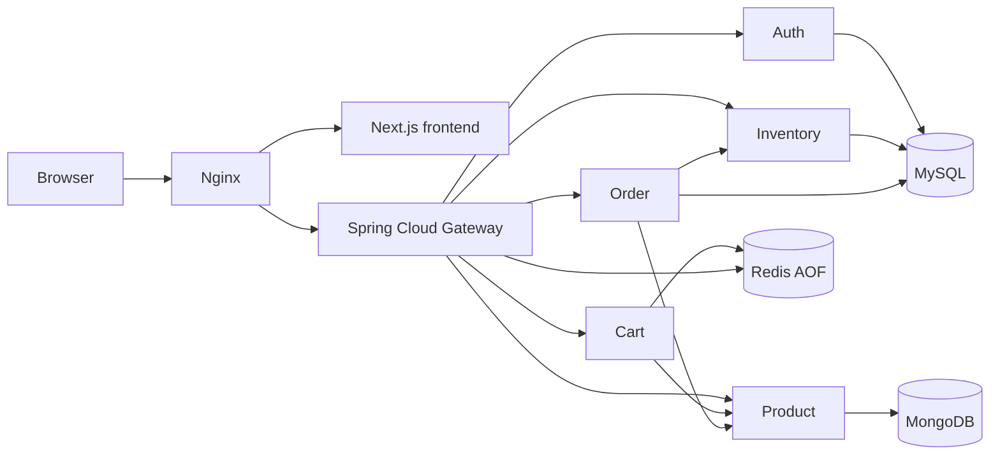
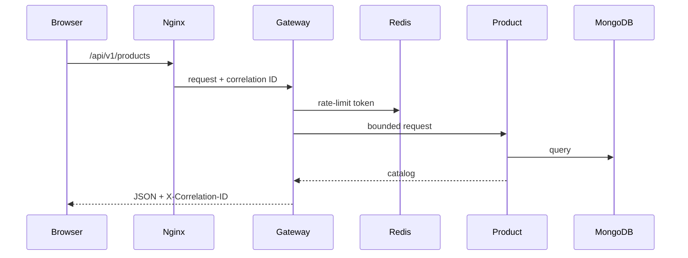

# Architecture
ShopSphere is a portfolio-scale, synchronous microservice marketplace, not a production-certified payment system.

Local development serves Next.js on :3000 and API requests through Nginx :80. Production Compose serves both from Nginx, with a relative /api/v1 base URL. The gateway validates access JWTs, enforces roles, rate limits, timeouts and correlation IDs. Cart/order also validate tokens and ownership.

| Service | Port (internal) | Store | Responsibility |
|---|---:|---|---|
| Auth | 8081 | MySQL | BCrypt credentials, register/login/refresh |
| Product | 8082 | MongoDB | Catalog and authoritative prices |
| Inventory | 8083 | MySQL | Stock and reservations |
| Cart | 8084 | Redis | User cart with configurable TTL |
| Order | 8085 | MySQL | Checkout, fulfillment, durable idempotency |
| Gateway | 8080 | Redis | API edge security and resilience |

Separate MySQL databases/users isolate service schemas. Mongo currently uses its initialization administrator: switch to a scoped application user before production. Redis holds carts and rate limits; cart TTL is intentional expiration, not a persistence failure. All volumes survive application restarts.

