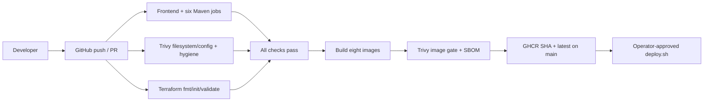

# CI/CD
ci.yml runs on main pushes, pull requests and manual dispatch. Frontend uses Node 22: npm ci, lint, build, typecheck. The Java 21 matrix runs Maven test/package for all six applications and uploads Surefire reports. Docker-enabled GitHub runners execute Testcontainers tests.

Reusable security.yml and terraform.yml are called by CI. docker-publish.yml is reachable only after successful validation and only for a main push. Each image is loaded and scanned before registry login/push; BuildKit gha caches are isolated by image. GITHUB_TOKEN needs contents:read and packages:write only in the publishing job. Pull requests never publish. No repository URL or personal token is hardcoded.

Images: ghcr.io/OWNER/shopsphere-{auth-service,product-service,inventory-service,cart-service,order-service,gateway,nginx,frontend}:SHA. Latest is a convenience tag; deploy the full SHA. The matrix can partially publish if another image fails: deploy only a completely green run.

Trivy gates fixed HIGH/CRITICAL dependency vulnerabilities, secrets and high-impact IaC findings. Unfixed dependency findings remain a documented residual risk. Narrow IaC exceptions are listed in .trivyignore; do not add blanket vulnerability suppressions. CycloneDX SBOM artifacts are generated per image. Dependabot covers npm, Maven, Actions, Docker and Terraform.

Before enabling deployment, configure repository branch protections and reviewers. There is intentionally no automatic AWS apply or SSH deployment workflow. scripts/deploy.sh is the explicit manual approval boundary. Workflows cannot be executed on GitHub until a remote repository is available.

References: [Docker BuildKit cache](https://docs.docker.com/build/cache/backends/gha/), [Trivy releases](https://github.com/aquasecurity/trivy/releases).
