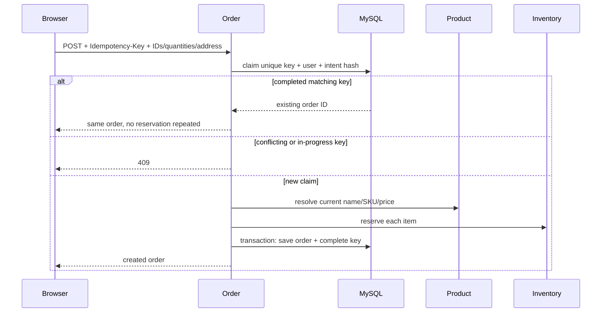

# Checkout safety and idempotency

Browser names, SKUs, unit prices, discounts and delivery charges are untrusted compatibility fields and ignored. Subtotal uses current catalog prices; discount is zero; delivery is free above INR 999, otherwise INR 99. Inactive/unavailable products cannot be purchased.

The database unique idempotency key prevents duplicate processing across service restarts. The request hash includes user, product IDs, quantities and shipping address, not untrusted pricing. The order insert and completed-key association share a transaction. Inventory reservations are compensated best-effort on caught failures, and failed claims are released.

Limitations: a process crash between reservation and completion can leave stock reserved and a PROCESSING key. Operators must reconcile against inventory/order records; never blindly expire and retry ambiguous claims. Cancellation/reservation workflows are synchronous, not a distributed Saga. Concurrent cancellation and partial compensation require further hardening. There is no payment provider or transactional outbox.
