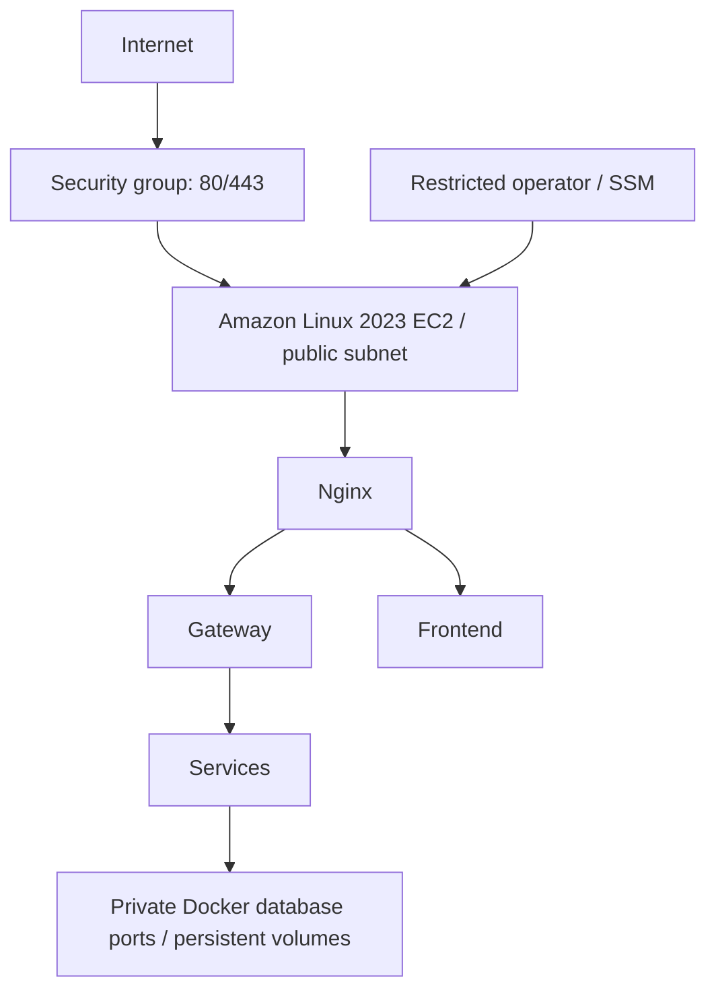

# Terraform AWS preparation
AWS infrastructure is Terraform-ready but has not been provisioned.



Four modules: networking (VPC/subnet/IGW/route/default-SG deny), security (web plus optional single IPv4 /32 SSH), IAM (EC2 SSM role), compute (AL2023 x86_64, IMDSv2, encrypted gp3 disk). No public MySQL/Mongo/Redis or application ports. Default EC2 is t3.large because six JVMs and three stores need roughly 8 GiB. Smaller instances are configurable but t3.small cannot reliably run the entire default stack. No free-tier claim.

Only HTTPS egress is allowed by the instance SG; VPC DNS uses the Amazon resolver. Package repositories must support HTTPS. HTTP is for a portfolio demo; the 443 rule is reserved for a later TLS configuration, not evidence that HTTPS is enabled.

```sh
cd terraform
terraform fmt -check -recursive
terraform init -backend=false -input=false
terraform validate
```

No AWS credentials are needed for these validation commands, but provider downloads require network access. Commit .terraform.lock.hcl, never state or real tfvars. backend.tf.example documents a preexisting private S3 state bucket; it does not provision it. Use AWS SSO/role-based credentials later.

After separate billing approval: configure tfvars/backend, review terraform plan, then manually authorize provisioning outside this validation task. Root EBS volume is retained on termination to reduce accidental data loss; retained disks and public IPv4 incur charges. Backups are still required.

Not included by default: NAT gateways, ALB, RDS, ElastiCache, Route53, CloudFront, WAF, ASG or EKS. A production design would put apps/managed stores in private subnets, add TLS, backups, flow logs and high availability.

Reference: [AWS IMDSv2](https://docs.aws.amazon.com/AWSEC2/latest/UserGuide/configuring-IMDS-new-instances.html).
